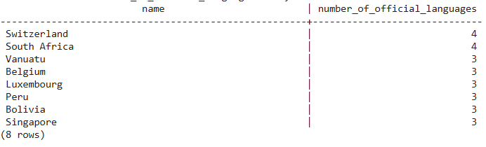
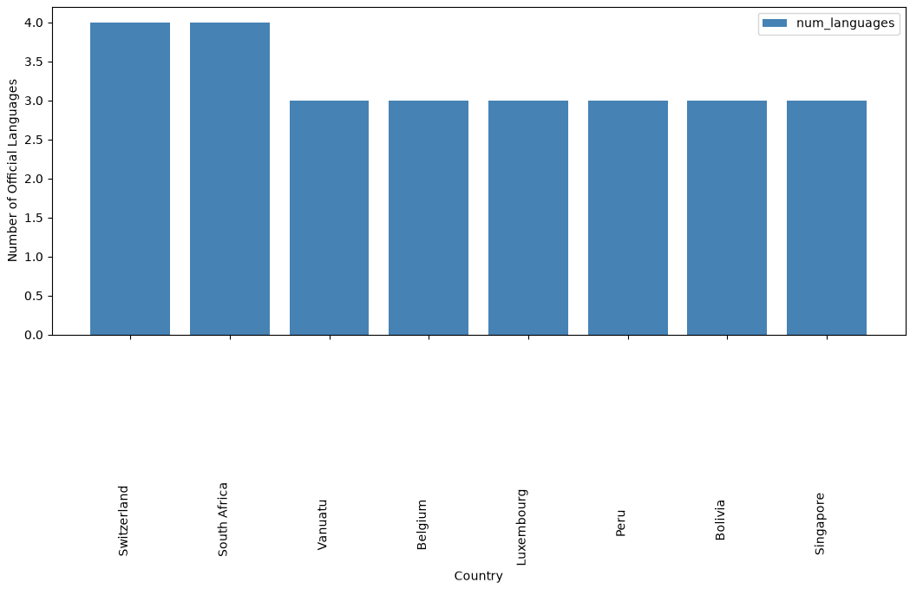

# Exercise 04: Advanced SQL, Jupyter, and Visualization

- Name:
- Course: Database for Analytics
- Module:
- Database Used: World Database
- Tools Used: PostgreSQL, SQLAlchemy, Pandas, Jupyter Notebooks

---

## Instructions

- Complete each task using the **World database** installed earlier.
- For SQL questions:
  - Write the SQL command in a fenced code block
  - Execute the command and include a **screenshot of the results**
- For Jupyter Notebook questions:
  - Include the required Python statements
  - Include **screenshots of the notebook output**
- Store all screenshots in the `screenshots/` folder and embed them below each question.

---

## Question 1

Considering the World database, write a SQL statement that will
**display the names of countries**
that speak **more than two official languages**,
along with the **number of official languages spoken**.

- Sort the results by **number of languages**, from **most to least**.
- _Hint: There are fewer than 10 countries in the results._

### SQL

```sql
SELECT c.Name, COUNT(cl.Language) AS number_of_official_languages
FROM country c
JOIN countrylanguage cl
  ON c.Code = cl.CountryCode
WHERE cl.IsOfficial = 'T'
GROUP BY c.Name
HAVING COUNT(cl.Language) > 2
ORDER BY number_of_official_languages DESC;
```

### Screenshot



---

## Question 2

Using **Jupyter Notebooks**, you must use the
`create_engine` command to connect to your database.

After the `create_engine` command is executed,
**what are the three statements** required to
execute the query from Question 1 and
**display the results in the notebook**?

### Python Code

```python
query = """
SELECT c.name, COUNT(cl.language) AS number_of_official_languages
FROM country c
JOIN countrylanguage cl
  ON c.code = cl.countrycode
WHERE cl.isofficial = 'T'
GROUP BY c.name
HAVING COUNT(cl.language) > 2
ORDER BY number_of_official_languages DESC;
"""

results = pd.read_sql_query(query, engine)
display(results)
```

### Screenshot


---

## Question 3

Using **Jupyter Notebooks**, write the Python code needed
to produce the following graph:


(The graph shows country-level results derived from the World database.)

### Python Code

```python
import matplotlib.pyplot as plt

plt.figure(figsize=(12, 6))
ax = plt.gca()

bars = ax.bar(
    range(len(results["name"])),
    results["number_of_official_languages"],
    color="steelblue",
    label="num_languages",
)

ax.set_xticks(range(len(results["name"])))
ax.set_xticklabels(results["name"], rotation=90, ha="right")
ax.set_xlabel("Country")
ax.set_ylabel("Number of Official Languages")
ax.legend(loc="upper right")

plt.subplots_adjust(bottom=0.25, left=0.08)
plt.show()
```

### Screenshot


