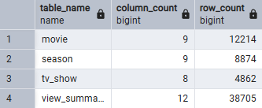
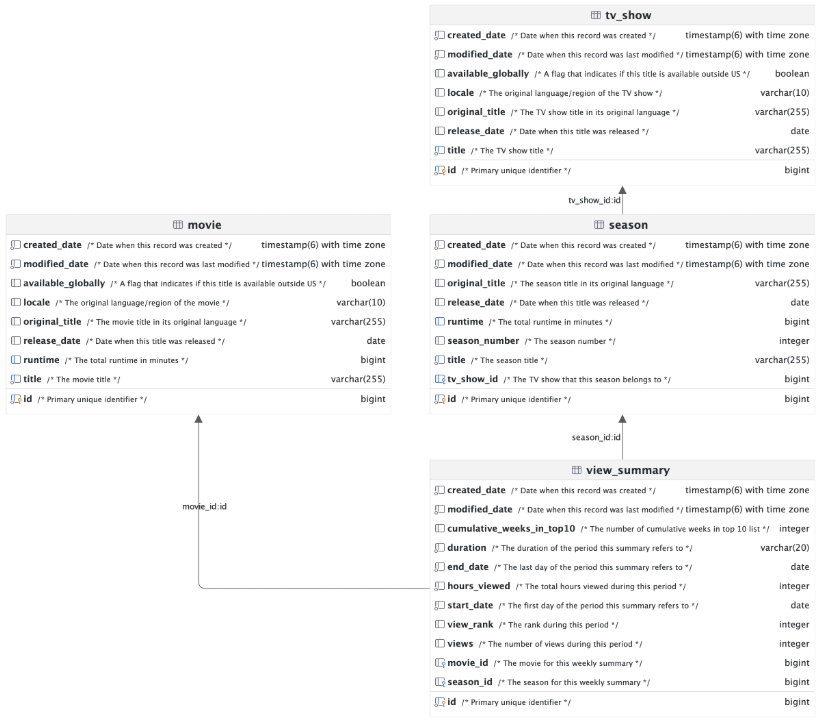
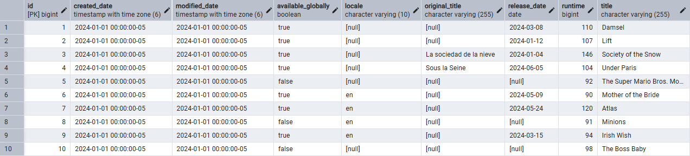
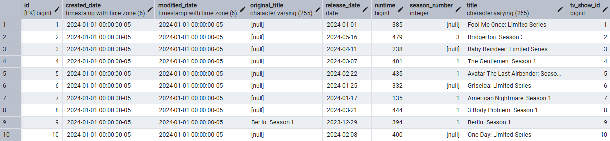
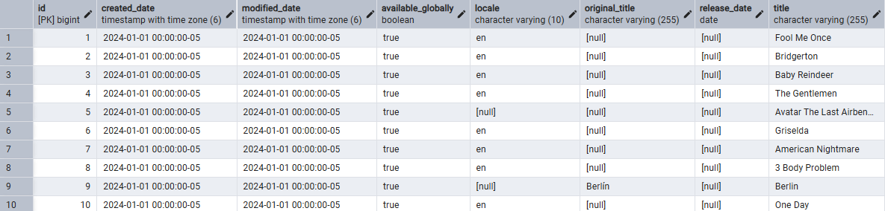
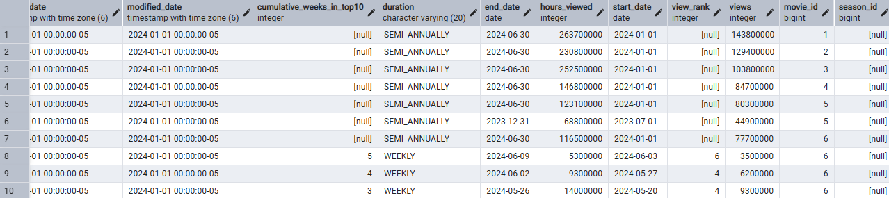
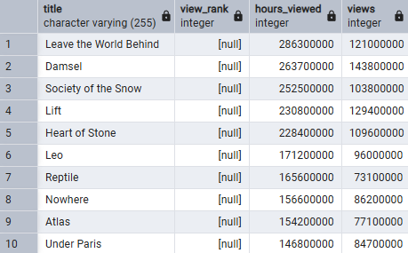
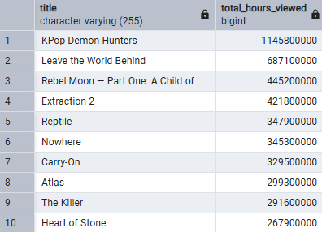

# Module 7: Netflix Database Project

### Molly Shelhamer
### 10/08/2026

## 1. Data Source

- **Source:** [Netflix Sample Database](https://github.com/lerocha/netflixdb)
- **Original format:** PostgreSQL SQL script
- **Database:** PostgreSQL
- **Purpose:** Analyze Netflix titles and viewing trends.

## 2. Data Dimensions



## 3. Data Dictionary



- **Source:** [Netflix Sample Database](https://github.com/lerocha/netflixdb)

## 4. Installation and Verification

Downloaded the PostgreSQL script from the public GitHub repository, created a database, and executed the script in pgAdmin. Verified the tables, column definitions, and record counts.

## 5. Table Structures and Contents

```sql
SELECT * FROM movie LIMIT 10;
SELECT * FROM season LIMIT 10;
SELECT * FROM tv_show LIMIT 10;
SELECT * FROM view_summary LIMIT 10;
```






## 6. SQL Analysis

### Query 1: Movies and Viewing Data

```sql
SELECT
    m.title,
    v.view_rank,
    v.hours_viewed,
    v.views
FROM movie AS m
JOIN view_summary AS v
    ON m.id = v.movie_id
ORDER BY v.hours_viewed DESC
LIMIT 10;
```



### Query 2: Viewing Hours by Movie

```sql
SELECT
    m.title,
    SUM(v.hours_viewed) AS total_hours_viewed
FROM movie AS m
JOIN view_summary AS v
    ON m.id = v.movie_id
GROUP BY m.id, m.title
ORDER BY total_hours_viewed DESC
LIMIT 10;
```


